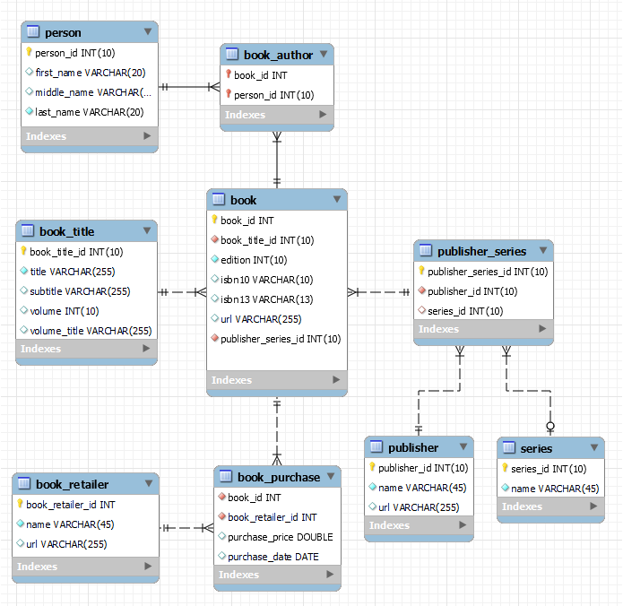

# books-db

The books database is just a sandbox database to be used in other code examples and demos.

books.mwb is the MySQL Workbench file fo the database design.

There is a small sample of data provided as insert statements.

books.sql is the database creation scipt generated from MySQL Workbench.

